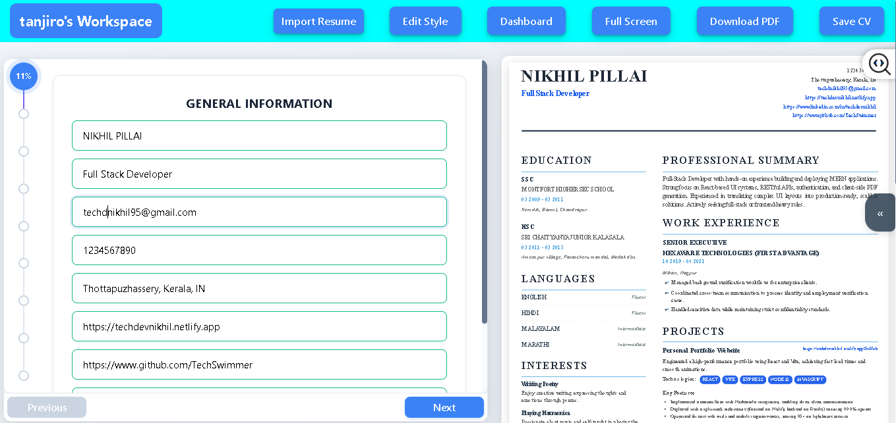
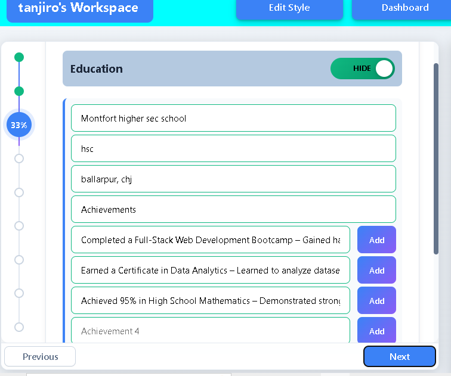
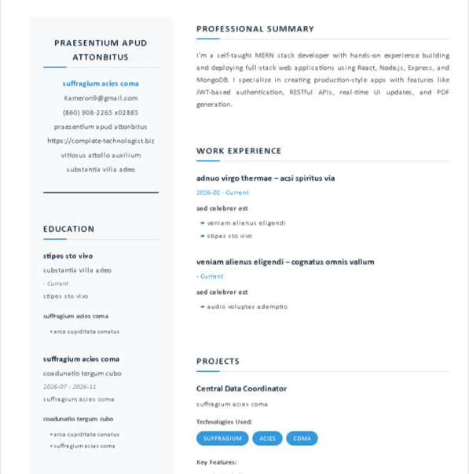
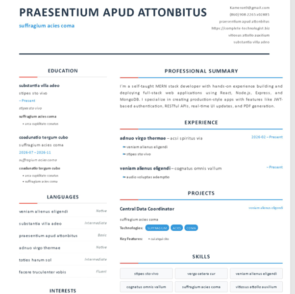
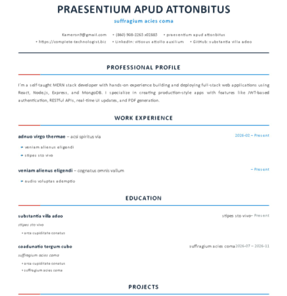

# ResuCraft 

ResuCraft is a comprehensive, full-stack resume building platform engineered for modern job seekers. It eliminates the friction of traditional document editing by providing a streamlined, AI-assisted interface that guarantees pixel-perfect PDF output. With ResuCraft, you can focus on your career narrative while our custom rendering engine handles the complexities of layout, spacing, and multi-page pagination across all devices.

## Table of Contents
- [Screenshots](#screenshots)
- [Features](#features)
- [Tech Stack](#tech-stack)
- [Project Structure](#project-structure)
- [Environment Variables](#environment-variables)
- [Getting Started](#getting-started)
- [API Endpoints](#api-endpoints)
- [Author](#author)

## Screenshots

*Resume builder main workspace view*

*Resume builder form input section*

*Full-screen live resume preview mode*

### Layout Templates
| Template | Visual Style |
| :--- | :--- |
|  | Classic professional single-column layout |
|  | Modern two-column layout with sidebar |
|  | Bold, high-contrast creative layout |

## Features
| Feature | Description |
| :--- | :--- |
| **PDF Export Engine** | Custom rendering engine ensures A4 documents look identical to the live preview |
| **Live Editor** | Real-time WYSIWYG editing experience with instantaneous layout updates |
| **AI Resume Parsing** | Smart extraction of text from existing PDF resumes to auto-populate form fields |
| **Multi-Layout Support** | One-click switching between professional template designs |
| **Dynamic Sections** | Flexible content management allowing you to reorder, add, or hide resume sections |
| **Responsive Design** | Fully optimized for building resumes on tablets and desktops |

## Tech Stack
| Layer | Technology | Purpose |
| :--- | :--- | :--- |
| Frontend | React 19 + Vite 6 | UI and component rendering |
| Backend | Node.js + Express 5 | API and server-side logic |
| Database | MongoDB + Mongoose 8 | User data and resume storage |
| Styling | Vanilla CSS | Modern, responsive UI |
| AI | OpenAI API | Parsing and resume optimization |

## Project Structure
- `/src` : Frontend source code
  - `/components` : Reusable UI components (PDF layouts, navbar, forms, animations)
  - `/pages` : Main application pages (Dashboard, Builder, Auth)
  - `/services` : API services, data normalization, and upload handling
  - `/constants` : App-wide static definitions and themes
- `/server` : Backend source code
  - `/controllers` : Controller logic for APIs (Auth, CVs, AI)
  - `/middleware` : Security, rate-limiting, and upload handling
  - `/models` : Mongoose database schemas
  - `/routes` : API endpoint definitions

## Environment Variables
| Variable | Required In | Description |
| :--- | :--- | :--- |
| PORT | Server | Port for backend server |
| MONGO_URI | Server | Database connection string |
| JWT_SECRET | Server | Secret key for auth tokens |
| OPENAI_API_KEY| Server | API key for AI features |
| AI_DEV_MODE | Server | Enables mock AI responses for local dev |
| VITE_API_URL | Frontend | URL of the backend API |

## Getting Started
1. Clone the repo: `git clone git@github.com:mohammad-sami-dev/resucraft.git`
2. Install dependencies: `npm install` (from the project root)
3. Configure environment variables (see [Environment Variables](#environment-variables))
4. Start Backend (from root): `npm run server`
5. Start Frontend (from root): `npm run dev`

## API Endpoints
| Method | Endpoint | Description |
| :--- | :--- | :--- |
| POST | /api/auth/register | Register a new user |
| POST | /api/auth/login | Login user |
| GET | /api/auth/user | Get user profile |
| DELETE| /api/auth/delete-account| Delete user account |
| POST | /api/cv/create | Create a new CV |
| GET | /api/cv/all | List all CVs for user |
| GET | /api/cv/:id | Get single CV |
| PUT | /api/cv/:id | Update CV |
| DELETE| /api/cv/:id | Delete CV |
| POST | /api/ai/parse-resume | Parse uploaded PDF resume |

## Author
[Mohammad Sami](https://github.com/mohammad-sami-dev)
